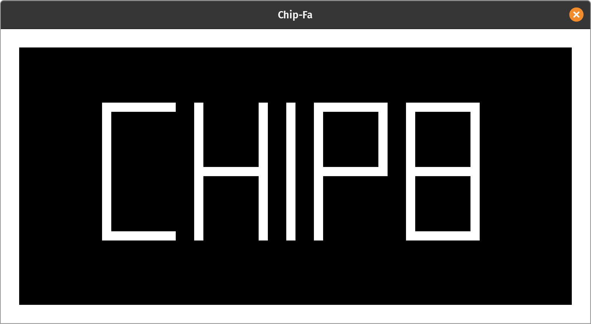
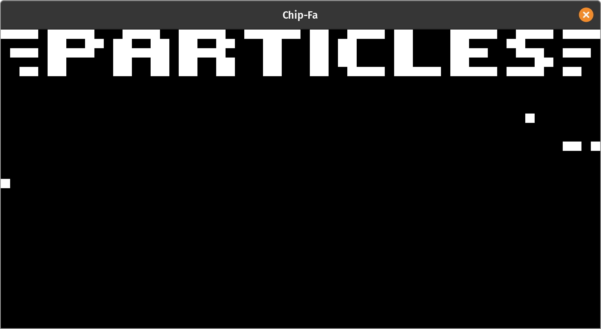
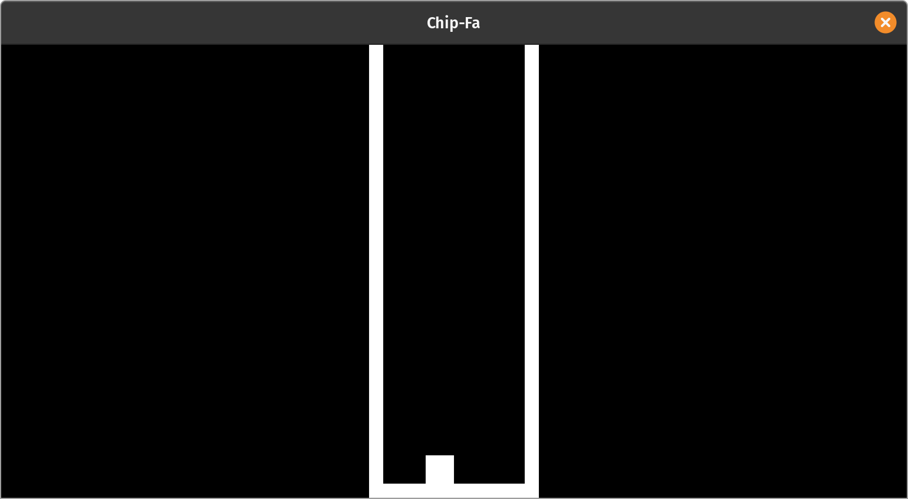

# Chip-Fa
A fully-featured [Chip8](https://en.wikipedia.org/wiki/CHIP-8) emulator written in GO.

## Current Status
The following is the planned features of Chip-fa:
- Screen emulation
- Sound emulation
- Keypad emulation
- Debugger (COMING SOON)
- Memory view (COMING SOON)

## Installation
Chip-fa's executable is currently available in these platforms:
- Windows x86
- Windows x64
- Linux x64


To download the executable, head to [release section](https://github.com/raveltan/chip-fa/releases).

For best experiece of using Chip-fa, please add it to the system PATH.
```bash
# Linux/Mac:
echo 'export PATH="$PATH:/path/to/chip-fa"' >> ~/.profile
source ~/.profile
# Windows:
set PATH=%PATH%;C:\path\to\chip-fa\
```

> All NON-LINUX releases is created with [XGO](https://github.com/karalabe/xgo) cross compile tool. compatibility not guaranteed.
## Usage
Running a ROM with default configuration
```bash
chip-fa -r roms/tetris.ch8
```
You can also set the window scaling using the -s flag
```bash
chip-fa -r roms/tetris.ch8 -s 2.0
```
If you are using HIDPI screen, please make sure to set the -x flag according to your system scaling if not done automatically.
```bash
chip-fa -r roms/tetris.ch8 -x 2.0
```
If you want to alter the amount of cycle per second, it can be done by the -c flag. 
```bash
# Run the emulator at 600/60 of the normal clock speed
chip-fa -r roms/tetris.ch8 -c 600
```
You can also enable debug mode for developing ROMS. (UNDER DEVELOPMENT).
This currently only allows user to stop and resume execution, other functionallity will be added later.
```bash
chip-fa -r roms/tetris.ch8 -d
```

## Screenshots




## Bug Reporting
Please create a new issue with the bugs detail.

## Support Us
Show your support to this project by submitting pull request or starring this project :))